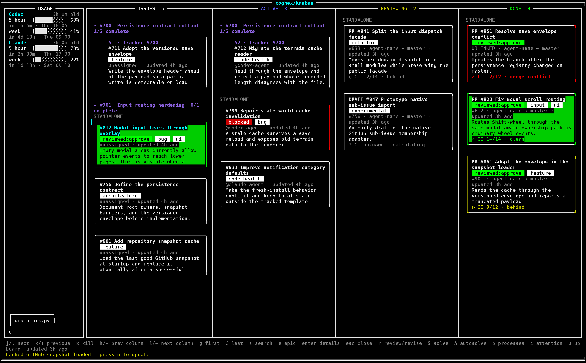

# Kanban

Kanban is a terminal board for GitHub projects. It reads a local checkout's
GitHub remote and sorts that repository's issues and pull requests into four
columns — Issues, Active, Reviewing, and Done — so the state of the work is one
keystroke away instead of one browser tab away.

It is for people who already live in a terminal and want the board there too:
it starts fast, stays idle when you are not using it, makes no network request
you did not ask for, and uses the GitHub CLI login you already have. Beyond the
board, it can optionally show Codex and Claude usage, start work on an issue,
run a review, and track those jobs without leaving the terminal.



## Quickstart

### Before you start

The board itself needs three things:

- [Git](https://git-scm.com/)
- [GitHub CLI](https://cli.github.com/), signed in with `gh auth login`
- GHC and Cabal, used to install the executable

That is the whole list. Codex, Claude, Kanban's workflow bundles, and the PR
drainer are needed only for the optional features described further down; the
board works without any of them.

Kanban is built and tested against **GHC 9.12.2 and Cabal 3.16.1.0** — the
versions the required CI job pins, and the ones an install is verified with.
[ghcup](https://www.haskell.org/ghcup/) installs both.

### Install from a release archive

Kanban releases are tagged `v<version>` and carry the `cabal sdist` source
archive `kanban-<version>.tar.gz` as their asset. **The first such archive
appears when `v1.0.0.0` is published; there is no published release yet.**
Until then, use the source checkout below.

From an empty directory:

```console
gh release download --repo coghex/kanban --pattern 'kanban-*.tar.gz'
tar -xzf kanban-*.tar.gz
cd kanban-*/
cabal update
cabal install exe:kanban
```

No clone of this repository is required. Omitting the tag downloads the latest
release, so the commands do not need editing when the version changes.

If `kanban` is not found afterwards, add Cabal's user binary directory
(normally `~/.local/bin`, or the path named in Cabal's installation warning) to
your `PATH`.

The archive carries `cabal.project`, which turns warnings into errors for the
`kanban` package — the gate contributors build under. On a toolchain other than
the verified one, a new warning can therefore stop an otherwise fine install.
If that happens, relax the gate for your local build and re-run the install:

```console
printf 'package kanban\n  ghc-options: -Wwarn\n' > cabal.project.local
```

**Keep the extracted directory.** The executable runs the board on its own, but
the optional setup tools, workflow bundles, and PR drainer are installed from
the tracked files inside that directory, and their setup commands are run from
it.

### First run

```console
kanban --version
kanban --path /path/to/project
```

Run inside a local GitHub checkout, `kanban` on its own opens that repository.
Kanban reads the repository's GitHub remote and uses your existing GitHub CLI
login.

The keys that matter first:

| Key | Action |
| --- | --- |
| `j` / `k` | Move between cards |
| `h` / `l` | Move between columns |
| `Enter` | Open card details |
| `s` | Search a column by number and title |
| `u` | Refresh the board and usage information |
| `p` | Show running and completed jobs |
| `i` | Show everything needing attention, and go to it |
| `?` | Show all controls |
| `q` / `Ctrl-C` | Quit |

Mouse selection, scrolling, and details are also supported. The
[user guide](docs/user-guide.md) documents every key, including the ones that
start the optional AI actions.

### Install from a source checkout

Contributors, and anyone who wants Kanban before the first release, install
from a clone instead:

```console
git clone https://github.com/coghex/kanban.git
cd kanban
cabal update
cabal build all
cabal install exe:kanban
```

Inside a checkout, `cabal run kanban` and `cabal run kanban -- --path
/path/to/project` are the equivalents of the installed commands, and run the
code on the current branch.

## Platform and component support

macOS is Kanban's supported platform for the first release. The table records
what that means per component. The PR drainer is the one component with a
supported Linux path so far; nothing here promises Linux support for the rest.

| Component | macOS | Linux | Notes |
| --- | --- | --- | --- |
| Core board | Supported | Built and tested in CI, not a supported user path | The required CI job builds the application and runs both test suites on Linux. Interactive board operation there has not been manually verified. |
| Optional AI actions | Supported | Not a documented setup path | [Workflow setup and preflight](docs/workflow-setup.md) describes a macOS setup path, not a cross-platform port. |
| Codex / Claude usage sidebar | Supported | Not verified | Kanban spawns the provider's own CLI and applies no platform check of its own. macOS is simply the only platform where the sidebar is verified. |
| PR drainer | Supported | Supported on a host with a systemd user session | The drainer is managed by whichever service manager the host has — launchd on macOS, a systemd user unit on Linux — and refuses only where neither is reachable. A dedicated CI job runs the whole install, start, status, stop, and uninstall lifecycle against a real systemd user session. Its install record, runtime state, and logs still sit under macOS-shaped `~/Library` paths on both platforms. |

Only the core board row is needed to use Kanban. Every other row is an optional
feature you can leave uninstalled.

## Optional AI actions

Kanban can start a solve, a review, or a revision on the selected card. Having
Codex or Claude installed and signed in is necessary but not sufficient: the
canonical issue-review backend and the Kanban-owned
`solve`/`pr-review`/`pr-rereview`/`pr-revise`/`repair` workflow bundles have to
be installed once as well.

One opt-in command covers all of them, and reports exactly what it would do
before changing anything. Run it from the extracted release directory or a
source checkout:

```console
python3 tools/setup_workflows.py --all --scope user
python3 tools/setup_workflows.py --all --scope user --apply
```

To see whether an AI action is ready, and what to run if it is not:

```console
kanban --doctor
```

`--doctor` is a read-only report on AI-action readiness: it installs nothing,
starts nothing, and changes nothing. It exits nonzero when an action is
blocked, which is a statement about that optional action only — the board runs
either way.

See [workflow setup and preflight](docs/workflow-setup.md) for the components,
scopes, recovery steps, and removal, and
[the agent-workflow contract](docs/agent-workflow-contract.md) for the full
dependency list and what each action requires.

## Optional PR drainer

The PR drainer merges approved pull requests after their required checks pass.
It installs as a launchd job on macOS and as a systemd user unit on Linux, and
refuses only on a host managed by neither. Preview the installation before
enabling it:

```console
python3 tools/install_drainer.py --dry-run --json
python3 tools/install_drainer.py
```

Installation does not start the drainer. Press `d` in Kanban when you are ready
to run it.

## Documentation

Start here:

- [User guide](docs/user-guide.md) — board layout, every control, reviews, and
  background jobs.
- [Workflow setup and preflight](docs/workflow-setup.md) — installing the
  optional AI-action components, and diagnosing why one is not ready.
- [PR drainer](docs/pr-drainer.md) — installation, configuration, operation,
  and logs.

For contributors:

- [Development](docs/development.md) — source layout, build commands, and tests.
- [Design and implementation notes](docs/design.md) — the behavior contract and
  the engineering decisions behind it.
- [Agent-workflow contract](docs/agent-workflow-contract.md) — every external
  workflow Kanban's AI actions depend on, and who owns each one.
- [Claude Code session instructions](CLAUDE.md) — the session contract for
  agents working in this repository.
- [Documentation index](docs/README.md) — everything else.

## Tests

From a source checkout or the extracted release directory:

```console
cabal build all
cabal test all --test-show-details=direct
python3 -m unittest discover -s tools -p 'test_*.py'
```

`cabal.project` applies the mandatory `-Werror` gate to those runs.

## License

[MIT](LICENSE)
